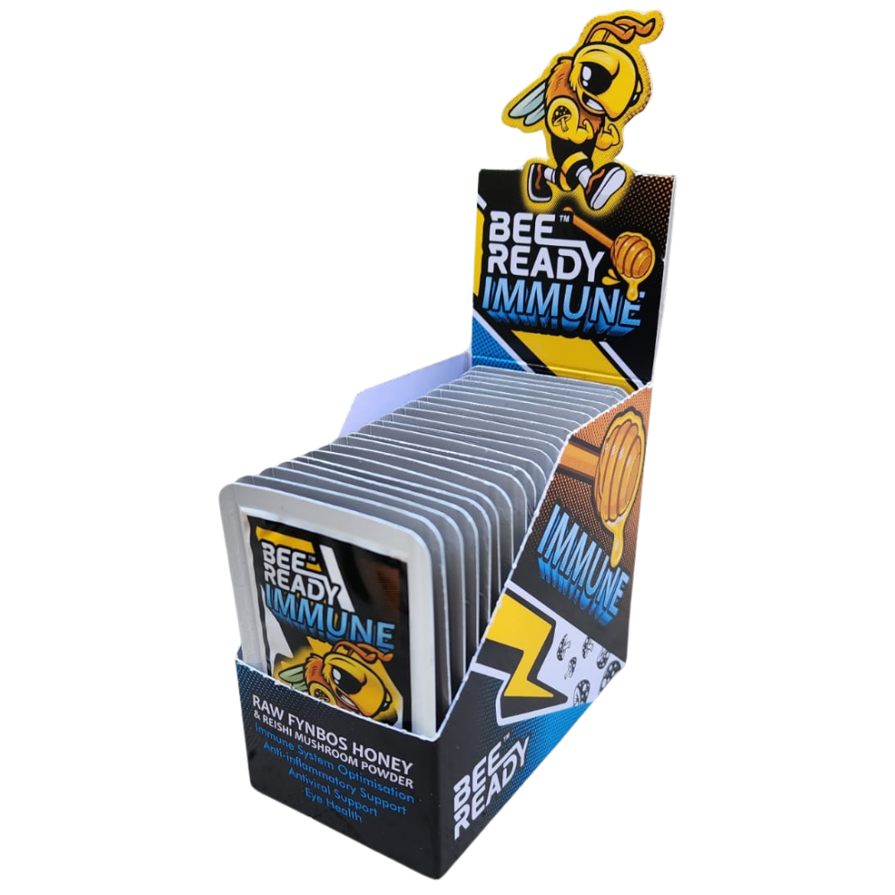
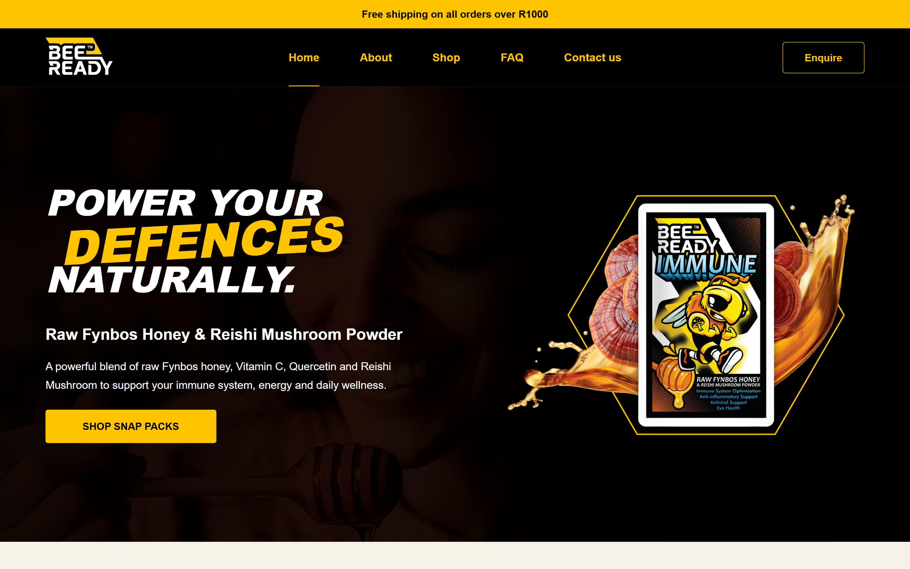
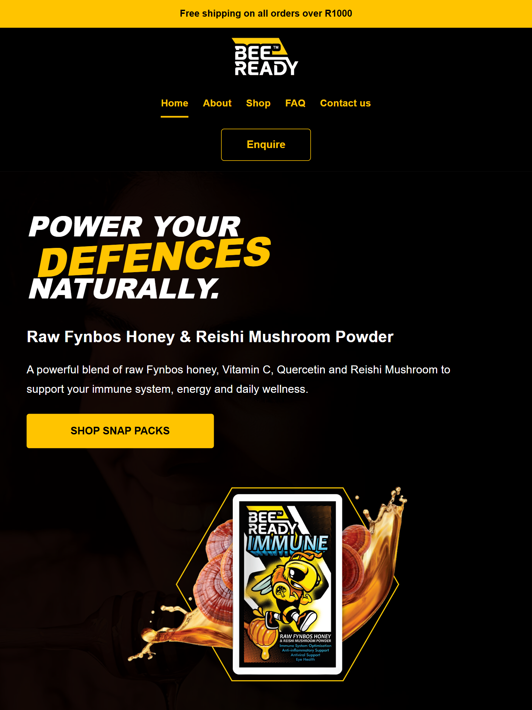
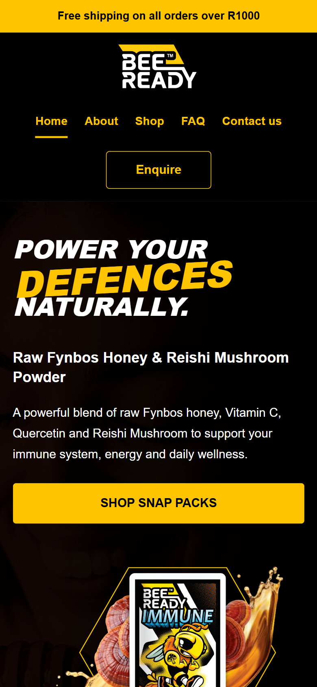

# BeeReady Website

## Student Information

- Name: Jaden Nell
- Student Number: ST10502027
- Module: WEDE5020
- Project: BeeReady Website
- Current Phase: Part 2 - CSS Styling and Responsive Design


---

# Project Overview

This project involves the planning, development and improvement of a website for BeeReady, a South African wellness business.

BeeReady offers convenient snap-pack honey products containing ingredients such as raw Fynbos honey, Reishi mushroom, Vitamin C and Quercetin.

The purpose of the website is to create a more complete and professional online presence for BeeReady while providing users with clear information about the brand, product, ingredients and how to make an enquiry.

The project is developed in different stages:

- Part 1 focused on planning, research, website structure and foundational HTML.
- Part 2 focuses on CSS styling, layout, visual design, responsiveness and usability.
- Future development can include additional JavaScript functionality and other improvements.


---

# Website Goals

The BeeReady website aims to:

- Create a professional online presence for BeeReady.
- Provide clear information about the BeeReady brand.
- Introduce and explain the BeeReady product.
- Provide information about the ingredients used in the product.
- Make the website simple and easy to navigate.
- Allow visitors to make product enquiries.
- Provide clear contact information.
- Create a responsive website that works across desktop, tablet and mobile devices.
- Build a strong foundation for future website development.


---

# Website Pages

The website currently contains six main pages:

1. Home - `index.html`
2. About - `about.html`
3. Shop / Products - `products.html`
4. FAQ - `faq.html`
5. Enquiry - `enquiry.html`
6. Contact - `contact.html`


---

# Sitemap

```text
Home
│
├── About
│
├── Shop
│
├── FAQ
│
├── Enquiry
│
└── Contact

The main navigation allows users to move between all major pages of the website.

Project Folder Structure
BeeReady/
│
├── css/
│   └── style.css
│
├── images/
│   │
│   ├── general/
│   │   ├── about-south-africa.png
│   │   ├── beeready-mascot.png
│   │   └── home-hero-bg.jpg
│   │
│   ├── logo/
│   │   └── beeready-logo.png
│   │
│   └── products/
│       ├── beeready-product.png
│       ├── beeready-product-small.png
│       ├── beeready-product-medium.png
│       ├── beeready-product-feature.png
│       │
│       └── ingredients/
│           ├── honey.png
│           ├── reishi.png
│           ├── vitamin-c.png
│           └── quercetin.png
│
├── js/
│   └── script.js
│
├── screenshots/
│   ├── desktop-home.png
│   ├── tablet-home.png
│   └── mobile-home.png
│
├── index.html
├── about.html
├── products.html
├── faq.html
├── enquiry.html
├── contact.html
└── README.md
Technologies Used

The project currently uses:

HTML5
CSS3
Visual Studio Code
Git
GitHub
Chrome Developer Tools
Live Server
Part 1 - Foundation and Planning
Part 1 Overview

Part 1 focused on building the foundation of the BeeReady website.

The main focus was:

Website planning
Content research
Organisation research
Sitemap development
File and folder organisation
Foundational HTML
Navigation
Basic page content
Website testing
Git and GitHub setup
Part 1 Features

The Part 1 website included:

Six HTML pages
Semantic HTML structure
Header
Navigation
Main page content
Footer
Internal links
Product information
Product images
Alternative text for images
Enquiry form structure
Basic contact information
HTML comments
Organised website folders
Basic browser testing
Part 1 Development Timeline
5-7 August 2026: Organisation research and content sourcing.
8-9 August 2026: Sitemap, wireframes and website planning.
10-12 August 2026: HTML structure and page development.
13 August 2026: Navigation, link and browser testing.
14 August 2026: Final review, documentation and repository preparation.
Part 1 Feedback

Part 1 received a mark of 80%.

No written lecturer feedback was provided before Part 2 development started.

Because no written feedback was supplied, there were no specific lecturer-requested corrections that could be implemented before beginning Part 2.

Part 1 Changelog
Initial Development
Created the BeeReady website project folder.
Created the required folder structure.
Created css, images and js folders.
Created six HTML pages.
Added semantic HTML structure.
Added header and navigation.
Added homepage content.
Added About page content.
Added Products page content.
Added FAQ page content.
Added Enquiry page.
Added Contact page.
Added enquiry form structure.
Added BeeReady product imagery.
Added image alternative text.
Added internal website links.
Tested all navigation links.
Created the website sitemap.
Completed content research and sourcing.
Created the project README.
Initialised Git.
Created the GitHub repository.
Pushed the project to GitHub.
Part 2 - CSS Styling and Responsive Design
Part 2 Overview

Part 2 focuses on improving the visual appearance, usability and responsiveness of the BeeReady website using CSS.

The HTML structure created during Part 1 was expanded and redesigned to create a more complete and professional BeeReady website.

Part 2 includes:

CSS styling
Typography
Colour styling
Layout design
Flexbox
CSS Grid
Hover states
Focus states
Responsive layouts
Media queries
Responsive images
Browser testing
Device testing
Part 2 Design Direction

The website follows a bold BeeReady brand style.

The design uses:

Black backgrounds
Bright yellow accent colours
White text
Bold typography
Bee and honey-inspired visual elements
Product imagery
Strong call-to-action buttons
Clean spacing
Responsive layouts
Colour Palette

The main colours used in the BeeReady website include:

Black - primary background colour
Yellow - main BeeReady accent colour
White - primary text and contrast colour
Red - supporting ingredient card accent
Blue - supporting ingredient heading accent
Cream - light page background colour
Typography

The website uses a clean sans-serif font stack:

font-family: Arial, Helvetica, sans-serif;

Typography styling includes:

Different heading sizes
Bold font weights
Line-height adjustments
Italic heading styles
Letter spacing
Responsive font sizing using clamp()
Part 2 Homepage Improvements

The homepage was redesigned to include:

BeeReady announcement bar
Branded black navigation header
BeeReady logo
Active navigation indicator
Enquiry button
Full-width hero section
Hero background image
Large promotional heading
Product feature image
Shop call-to-action button
About BeeReady section
Product section
Responsive layout
Branded footer
Part 2 About Page Improvements

The About page was redesigned to include:

BeeReady branded header
Large visual image section
South African brand focus
"Proudly South African" heading
Two-column desktop layout
Responsive single-column mobile layout
Improved spacing and typography
Part 2 Shop / Products Page Improvements

The Products page was redesigned to include:

Central product feature
BeeReady product artwork
Product title
Product description
Product enquiry call-to-action
Ingredient information section
Responsive product layout
Product Ingredients Section

The product page includes four ingredient cards.

Raw Fynbos Honey

Harvested from South Africa's unique floral kingdom.

Natural energy source
Rich in antioxidants
Supports overall wellness
Reishi Mushroom

Known as the "Mushroom of immortality".

Supports immune function
Helps the body adapt to stress
Traditionally used in wellness products
Vitamin C

An essential vitamin included in the product formulation.

Supports immune function
Antioxidant properties
Helps protect cells from oxidative stress
Quercetin

A naturally occurring plant flavonoid.

Antioxidant properties
Included in the BeeReady formulation
Complements the other ingredients
Part 2 FAQ Page Improvements

The FAQ page was redesigned using responsive cards.

Improvements include:

Structured FAQ layout
Responsive grid
Hover effects
Enquiry call-to-action
Improved spacing
Improved readability
Part 2 Enquiry Page Improvements

The Enquiry page includes a styled form with:

Full Name field
Email Address field
Phone Number field
Enquiry Type dropdown
Message textarea
Submit button

The form includes:

Consistent spacing
Styled inputs
Focus states
Responsive layout
Accessible labels
Part 2 Contact Page Improvements

The Contact page was improved with:

Contact introduction section
Contact information card
Website information
Product enquiry information
Enquiry call-to-action
Responsive layout
Header and Navigation

The website header includes:

BeeReady logo
Home
About
Shop
FAQ
Contact Us
Enquire button

The header uses:

Flexbox and CSS Grid
Hover effects
Active page states
Focus states
Responsive layouts
Footer

The BeeReady footer includes:

BeeReady mascot
Yellow dot design
Website navigation
Copyright information
Responsive layout
CSS Techniques Used

The website uses a range of CSS techniques including:

CSS reset
CSS variables
Flexbox
CSS Grid
Relative units
rem
Percentages
clamp()
Media queries
Pseudo-classes
:hover
:focus
:active
Transitions
Border radius
Box shadows
Background images
Linear gradients
Responsive image sizing
Responsive Design

The website was designed to work across multiple screen sizes.

Main breakpoints include:

Desktop: above 1024px
Tablet: 1024px and smaller
Mobile: 768px and smaller
Small Mobile: 480px and smaller

Multi-column layouts automatically change to fewer columns or single-column layouts on smaller screens.

Responsive Images

Responsive product images were implemented using the HTML srcset and sizes attributes.

The following image sizes are available:

beeready-product-small.png - 400px
beeready-product-medium.png - 800px
beeready-product.png - 1000px

Example:



This allows the browser to choose a suitable image depending on the size of the user's device.

Responsive Testing

The website was tested at multiple screen sizes using Chrome Developer Tools.

Testing included:

Navigation
Header
Hero sections
Images
Text readability
Buttons
Forms
Product sections
Ingredient cards
Footer
Page spacing
Horizontal overflow
Responsive stacking
Responsive Testing Screenshots
Desktop - 1440 x 900

Tablet - 768 x 1024

Mobile - 390 x 844

Browser Testing

The website was tested using Live Server and browser developer tools.

Testing included checking that:

All website pages load correctly.
Navigation links work.
Images load correctly.
No broken internal links are present.
Responsive layouts work correctly.
Forms display correctly.
Buttons and links respond correctly.
No major horizontal overflow occurs.
Accessibility

Basic accessibility considerations include:

Alternative text added to images.
Form fields include labels.
Navigation uses semantic <nav> elements.
Focus states are visible.
Text contrast is maintained.
Responsive text sizing is used.
Buttons and links remain readable on smaller devices.
Part 2 Changelog
CSS Setup
Linked style.css to all six HTML pages.
Added a global CSS reset.
Added reusable CSS colour variables.
Added base typography styling.
Added responsive image styling.
Header
Added BeeReady announcement bar.
Redesigned the main navigation.
Added BeeReady logo.
Added active page indicators.
Added hover effects.
Added focus states.
Added enquiry button.
Made the header responsive.
Homepage
Redesigned the homepage hero.
Added full-width hero background.
Added product artwork.
Added promotional heading.
Added shop call-to-action.
Improved homepage About section.
Improved homepage Product section.
About Page
Redesigned the About page.
Added Proudly South African content section.
Added large visual image layout.
Added responsive two-column layout.
Shop Page
Redesigned the Products / Shop page.
Added main product feature.
Added product enquiry button.
Added product ingredient section.
Added four responsive ingredient cards.
Added ingredient images.
Added card hover effects.
FAQ Page
Redesigned FAQ page.
Added responsive FAQ card layout.
Added hover effects.
Added enquiry call-to-action.
Enquiry Page
Styled enquiry form.
Styled form labels.
Styled input fields.
Styled dropdown menu.
Styled textarea.
Added focus states.
Styled submit button.
Contact Page
Redesigned contact layout.
Added contact information card.
Added enquiry button.
Footer
Redesigned footer.
Added BeeReady mascot.
Added yellow dot pattern.
Added footer navigation.
Added responsive footer behaviour.
Responsive Development
Added tablet breakpoint.
Added mobile breakpoint.
Added small mobile breakpoint.
Converted multi-column layouts to single-column layouts when required.
Added responsive typography.
Added responsive images.
Tested the site at multiple screen sizes.
Testing
Tested desktop layout.
Tested tablet layout.
Tested mobile layout.
Tested website navigation.
Tested internal links.
Tested form layout.
Tested images.
Checked responsive page stacking.
Added responsive screenshots to the repository.
Future Development

Possible future improvements include:

Functional form submission
Form validation
JavaScript interactions
Mobile hamburger menu
Product purchasing functionality
Shopping cart functionality
Checkout functionality
Additional animations
Search engine optimisation
Additional product pages
References

BeeReady. n.d. BeeReady. [Online].
Available at: https://beeready.co.za/
[Accessed 21 August 2026].

WowBuy. n.d. Bee Ready Immune Booster. [Online].
Available at: https://wowbuy.co.za/product/bee-ready-immune-booster/
[Accessed 21 August 2026].

New Perspective Design. 2026. What Does a Website Cost in South Africa? 2026 Price Guide. [Online].
[Accessed 21 August 2026].

xneelo. n.d. Web Hosting. [Online].
Available at: https://xneelo.co.za/web-hosting/
[Accessed 21 August 2026].

xneelo. n.d. Domain Names. [Online].
Available at: https://xneelo.co.za/domains/
[Accessed 21 August 2026].

Repository

GitHub Repository:

https://github.com/Jaden-Nell/BeeReady-WEDE5020-Part1


Then:

1. Replace `[Your Full Name]` and `[Your Student Number]`.
2. **Ctrl + S**
3. Source Control → stage `README.md`
4. Commit:

```text
Fix README responsive screenshots
Sync Changes / Push
Refresh the GitHub README.

The important corrected lines are now:



